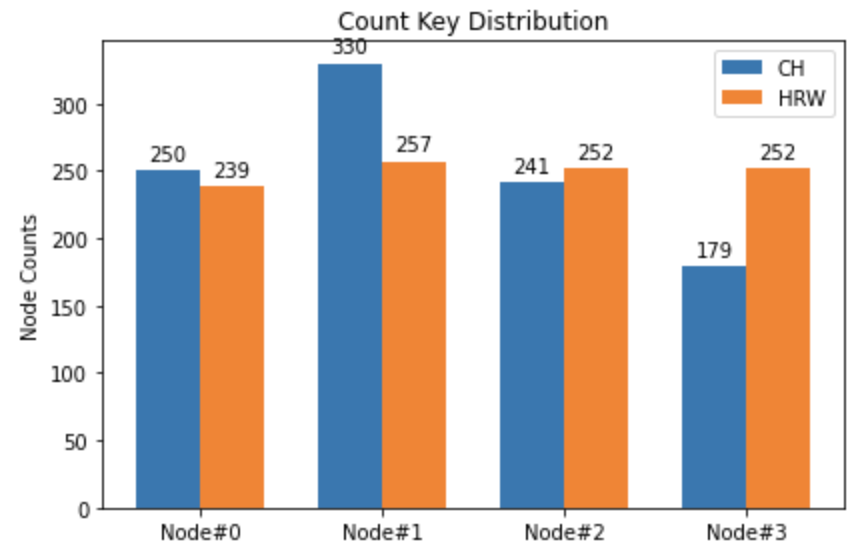

# Consistent Hashing and HRW Hashing

## Part 1. Rendezvous Hashing(Highest Random Weight)

Full code in [here](RendezvousHashing.py)

```python
class HRW:
    def __init__(self, nodes):
        assert len(nodes) > 0
        self.nodes = nodes

    def get_node(self, key_hex):
        weights = [mmh3.hash(key_hex, i) for i in range(len(self.nodes))]
        node_index = weights.index(max(weights))
        return self.nodes[node_index],
```

## Part2. Consistent Hashing

Full code in [here](ConsistentHashing.py)
```python
class CH:
    # init the consistent node ring
    def __init__(self, nodes, replication_factor=8):

    # add a node to the ring
    def add_node(self, node):

    # remove a node
    def remove_node(self, node):

    # get the node index of a provided key, as well as the next node for data replication
    def get_node(self, key):
```

Add virtual node:
```python
for i in range(self.rep):
    # generate hash code of vnode by name
    v_hash = mmh3.hash((str(node) + f"#{i}").encode()) % self.M
    self.nodehash[v_hash] = node
    self.nodering.append(v_hash)
```

Do data replication when getting node of keys, the method will return the target node as well as the replication node
 for data replication:
```python
node_list = [self.nodehash[self.nodering[n_i]]]
        n_nxt = (n_i + 1) % len(self.nodering)
        # avoid same data replication in same actual node
        while self.nodehash[self.nodering[n_i]] == self.nodehash[self.nodering[n_nxt]]:
            n_nxt = (n_nxt + 1) % len(self.nodering)
        node_list.append(self.nodehash[self.nodering[n_nxt]])
        return node_list
```

### Result

Key distribution for 1k keys:
(Full code in [here](distribution_test.ipynb))



We can see that RHW has better load balance compare to CH.


# Appendix

The distributed cache you implemented in the midterm is based on naive modula hashing to shard the data.

## Part I.

Implement Rendezvous hashing to shard the data.


## Part II.

Implement consistent hashing to shard the data.

Features:

* Add virtual node layer in the consistent hashing.
* Implement virtual node with data replication. 
